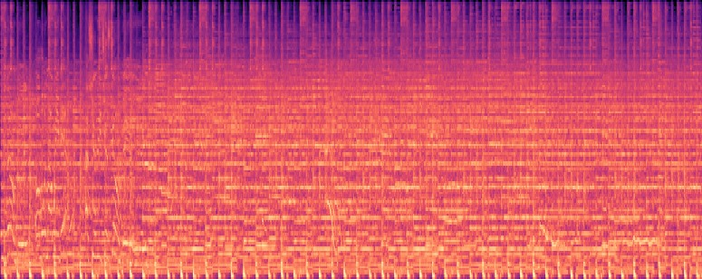
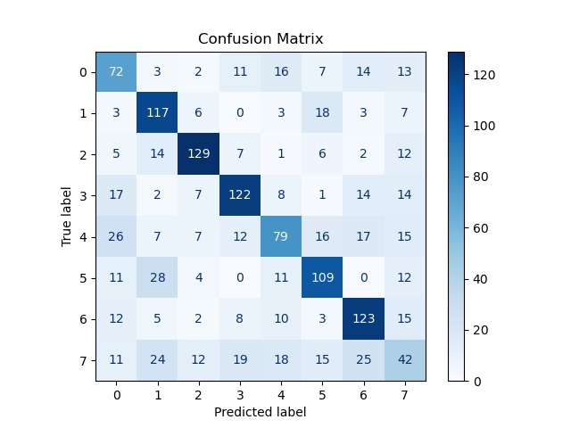
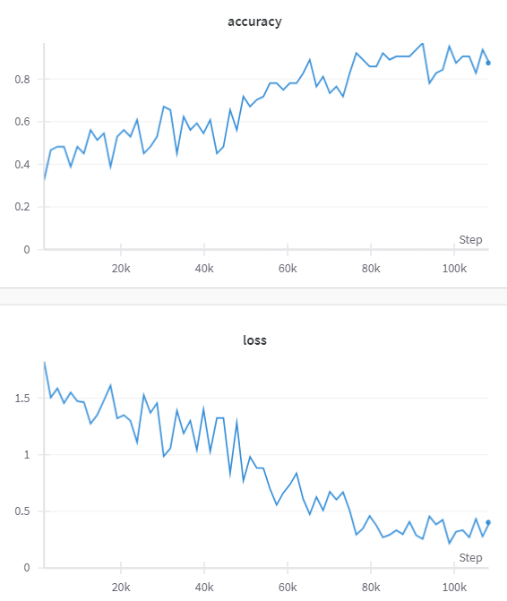
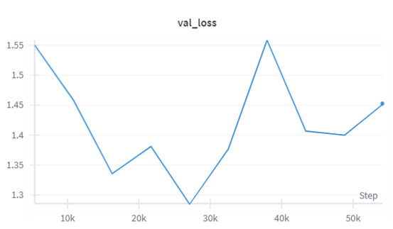
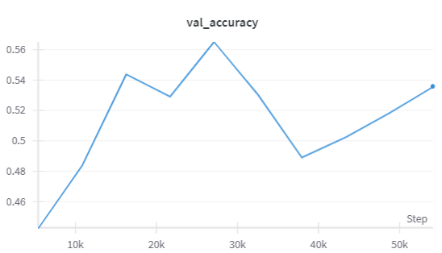
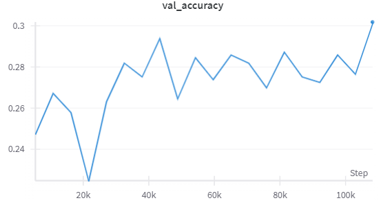

# XNAP-FMA Music Genre Classification - Group 9
Our project, Music Genre Classification, focuses on developing and applying deep learning models to classify music tracks into distinct genres. Utilizing the Free Music Archive (FMA) dataset, our goal is to leverage advanced deep learning techniques to accurately identify and categorize music based on its audio features. This ReadMe provides a comprehensive overview of our project, detailing the structure of our repository, the data used, the code implementation, the models explored, the training processes, and the results obtained, along with our conclusions. 

## ReadMe structure:
- [Repository Structure](#repository-structure)
- [Initial Data](#initial-data)
- [Code Structure](#code-structure)
- [Models](#models)
- [Training](#training)
- [Testing and Results](#testing-and-results)
- [Conclusions](#conclusions)
- [Contributors](#contributors)

## Repository structure:
- `DL_music_classifier.ipynb`: This noteobok contains all the code followed to extract the data and prepare it for the training.
- `main.py`: This python script contains a part of the preprocessing of the spectrograms (converting their genres to numeric values for comfortability) and calls functions from the rest of the files in an ordered way.
- `utils.py`: This script is responsible for making the adequate changes to the datatype and shape of the spectrograms as well as splitting the data into the different sets that will be used later.  
- `train.py`: This script is the repsonsible one for training the data by batches and compute the validation.
- `models.py`: Contains all the models tried for this project
- `test.py`: Is the python script responsible for testing the model with unseen data. 
- `analysis.ipynb`: Contains an analysis and hypothesis of our model's missclassifications. 

## Initial data:
The used data is from the github repository [FMA dataset repository](https://github.com/mdeff/fma.git). There is a folder called fma where all the datasets are available. The used ones are fma_small (the small version is the one used in this project due to the excessive size of the other files) and fma_metadata where all the information regarding the tracks can be found. 
There were 8000 tracks, 8 genres for the column of genre, and 163 subgenres for the column of genres_all (list of subgenres of the track). 

The data can be obtained by cloning the repository and downloading the datasets as can be seen in the notebook. 

## Code structure:
First and foremost, it is crucial to obtain the data and modify whatever necessary to treat and work with it. Whether that is changing formats, names, paths...

After preprocessing, a dataframe is created with the information needed; mainly: track id and the genres.

Once that is created, the data is transformed to spectrograms (using the `librosa` library) so as to feed the models images rather than mp3 tracks. Afterwards, the spectrograms were saved in zip files. Finally, a CSV file is created with the paths to the spectrograms and their relative genres. 

Once those are created, there is no need to rerun the notebook. The only necessary bit to run is the unzip function to get the spectograms folders in the workspace. 
It is important to notice that the notebook was the file where a lot of the preprocessing occured initially, to explore the data, its format and distribution. 

In `main.py` and `utils.py`, the data is finally accomodated to the model's convenience. That is: tensors of 3 channels and size 224 x 224. Moreover, the labels are, as previously mentioned, converted to numerical valued. In addition, the wandb platform is started there. The configuration of the model is passed and throughout the training and testing, the models are saved providing the user a clear view of the models' performances and evolution. (See the link below)
[See how we trained different models on Weights & Biases](https://wandb.ai/projectdeeplearning/Name?nw=nwusermartinacarrettab)

Once that is arranged, the `train.py` file takes the dataloaders and trains the model with the assigned number and size of batches. 

It makes use of a learnign rate scheduler (lr_scheduler.ReduceLROnPlateau), cross entropy loss as the criterionadn Adam optimizer. (Others like AdamW have been tried and performed quite similarly, nevertheless it was found that Adam was the one with better results). 

## Models:
The models tried were: 
- **ConvNet** (baseline)
- **ResNet50** (pretrained)
- **MusicGenreCNN** with 3 layers
- **ImprovedMusicGenreCNN** with 4 layers
- **ConvNetIMPROV** with 3 layers
- **ImprovedMusicGenreCNNv2** with 6 layers a high dropuout values. 

## Training:
Regarding the models, the first training trial was the given model ConvNet. Although there were some improvements, the model gave more or less an accuracy inside the range of [40 - 50]%. This model was tested with combinations of epochs between [10 - 70], learning rates between [1e-3 to 1e-5], an activation of ReLU and leaky ReLU, and dropout probabilities between [0,1 - 0,5].

After some research and inspiration from other projects, ResNet50 was tried yet the accuracies were not improved. There was only one run that exceeded the previous range of accuracies which got a test accuracy of 51,48. The rest had pretty much the same values.

Given the line of improvement, the next goal was to add complexity to the models through layers so both of the tried models were modified to accomodate more layers to try and capture mode intrinsic patterns of the data. After training several times said improved models, the accuracy was consistently getting to values around 55%. 

The last batch of trials for a new model was done with a second version of improvement. The key to this new model was the dropout values. After careful consideration, a hypothesis was drawn: the model overfits the training data which is reason for the low training loss yet the not so great validation and test accuracy. 
The training of this model maininly revolved around fine-tuning the dropout probability. Beggining with low values and gradually increasing them, the result was that values around 0.7 were the ones working the best. 
The rest of the parameters (epochs, batch size, learning rate, scheduler, optimizer) were also changed however, they were finally kept like in the other model's runs due to the slightly better performance. This final model consistenly got accuracies of around 57% and the best one got to a test accuracy of 59,01%

## Testing and results:
Throughout most of the models, the test accuracy resulted in values of around 55% which was low considering that the training losses were always lower than 2 and in sopme cases it got to 0. These results describe most likely overfitting from the models.

The resulting confusion matrix is the following:

And these are statistics of the best model trained:

In order to prevent overfitting, several techniques have been tried. Data augmentation (time stretching, pitch shifting and noise to the audio signal) did infact lower the test accuracy by a little less than 10%: test accuracy = 47,93%.

Other techniques which were tried and failed were training with spectrograms plus genres_all column (got several errors and horrible performance) and class weights for the criterion in an attempt to make the model focus on the classes with which the classification was subpar (got test accuracy of 27%).

## Conclusions:
Various deep learning models were developed and tested for music genre classification. While the models demonstrated effective learning on the training data, their performance on test data was lower, indicating overfitting. The best model achieved a test accuracy of 59.01%, suggesting there is room for improvement in generalization. Initial models had moderate success. Enhancing model complexity and adding more layers improved performance, with the highest accuracy achieved by increasing dropout to prevent overfitting.

Extensive tuning of parameters such as learning rates, epochs, activation functions, and dropout rates led to incremental improvements. However, overall gains were modest, highlighting the challenges in optimizing these models. Data augmentation techniques reduced accuracy, indicating they did not benefit the models significantly and suggesting a need for a different approach. 

As mentioned in the `analysis.ipynb`, it is important to note that the spectrograms are generated after a short period of time from the track. It would be worth to further analyze what part of the spectrogram is the model focusing on to provide an exhaustive study of the results. In addition, a possible approach to enhance the model's performance would be to get different and varied parts of each track thus allowing the model to learn and generalize better.  

Misclassifications often occurred due to shared attributes among tracks with different primary genres, complicating the model's ability to distinguish them. Additionally, tracks with the same top genre can sound very different if they contain diverse secondary genres, adding another layer of complexity.

Future improvements could involve experimenting with more advanced models and incorporating additional features like metadata to enhance genre classification accuracy. Overall, while the project made notable progress, it also underscored the complexity of the task and identified areas for further research and refinement.

## Contributors
- Martina Carretta: 16739300@uab.cat
- Mariona Pla: 1616474@uab.cat
- Ares Sellart: 1665890@uab.cat

Xarxes Neuronals i Aprenentatge Profund
Grau de Artificial Intelligence
UAB, 2024
